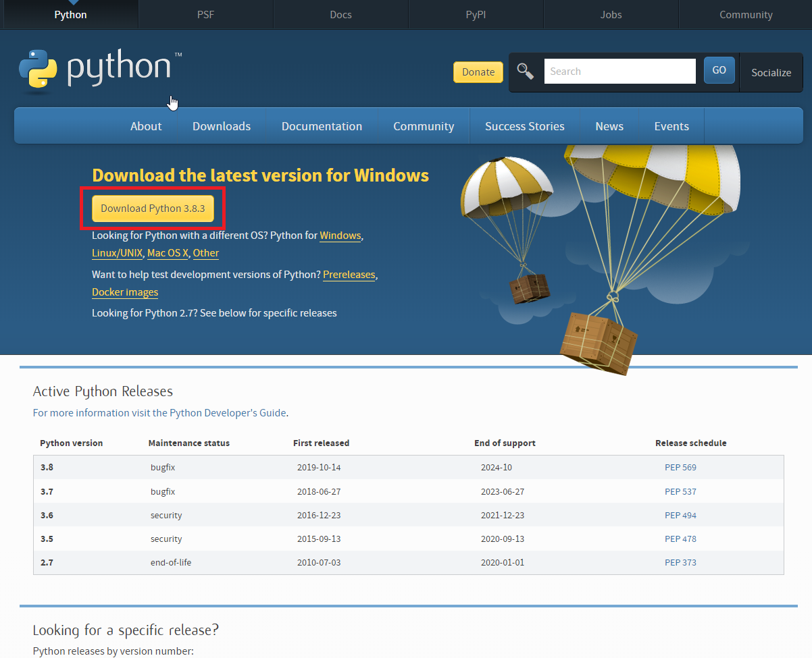
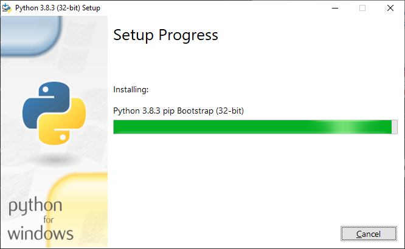
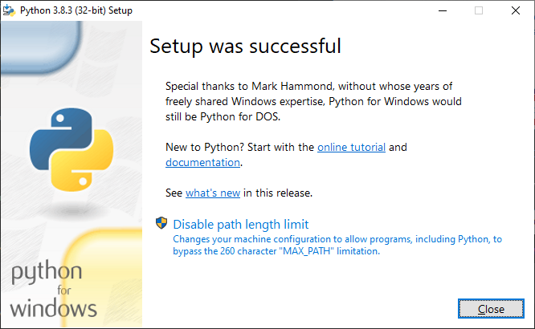
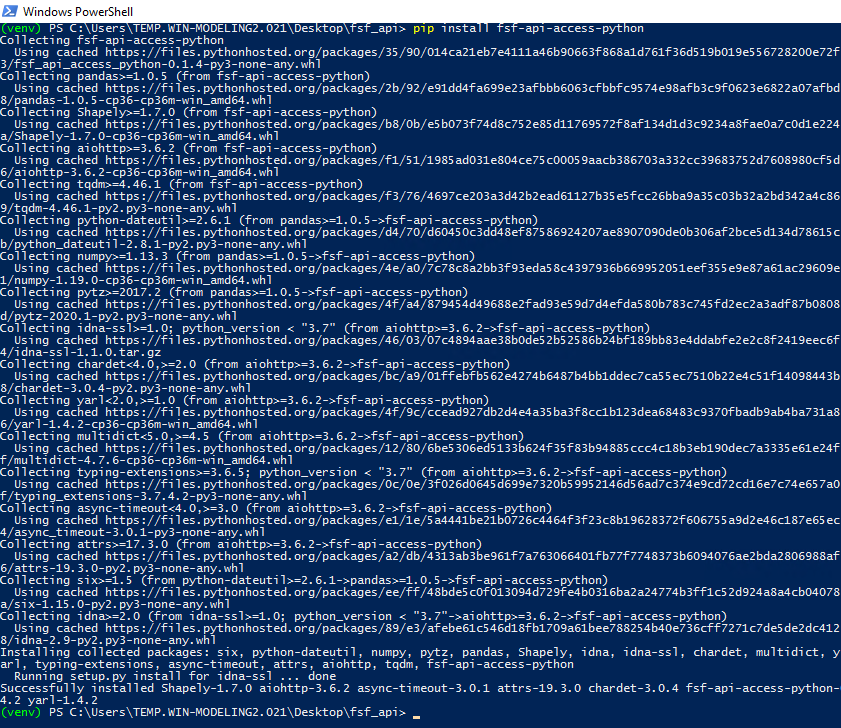

# First Street Foundation API Access Documentation (Python)
The First Street Foundation API Access (Python) is a wrapper used to bulk extract flood data from the First Street Foundation API

## Installation
**NOTE**: This project requires [Python](https://www.python.org/downloads/) 3.6+ to run.
1. Go to the Python page (https://www.python.org/downloads/) and download then install Python version 3. **Make sure that the checkbox is checked for Python to be added to the PATH**

    
    
    
    
    
    
    
    
1. Install the source code manager [Git]
2. Open `git bash` and create then navigate to a new project directory

    
    
    
    
3. Clone the project repository (https://github.com/FirstStreet/fsf_api_access_python.git) to the new directory
    ```sh
    Example File Structure:
    
    .
    ├── fsf_api_access_python
    ```
    
    

4. [Optional] Open a console and create and activate a new virtual environment in the project directory:
    ```sh
    python -m venv /path/to/new/virtual/environment
   
    cd /path/to/project
   
    .\venv\Scripts\activate
    ```
    
    
    
    
    
5. Run the setup script to install the project requirements
    ```sh
    pip install .\fsf_api_access_python\.
    ```
    
    
    
6. The project is now setup and can be ran through one of the two methods below. See `Products` for additional details on how to extract flood data products from the API.
    ```sh
    Example File Structure:
    
    .
    ├── fsf_api_access_python.
    ├── venv
    ├── my_script.py

## Method 1: Through the Client
**[Reminder] Keep your API key safe, and do not share it with others!**

1. Create a new Python script and initialize a First Street Foundation API Client. 
    ```python
    # Contents of my_script.py
    import firststreet
    fs = firststreet.FirstStreet("api-key")
    ```
    
2. Call one of the methods described below in the `Products` section with the required arguments. See the `Examples` section for more examples.
    ```python
    fs.<product>.<product_subtype>(<fsids: list>, <lookup_type: string>)
    ```
    
    
    
3. Run the python script.

    

## Method 2: Through the Command Line
**[Reminder] Keep your API key safe, and do not share it with others!**

1. [Required] Set an Environmental Variable with the variable_name as `FSF_API_KEY` and the variable_value with the API_KEY.
    
    
    
    
    
    

2. Open a new console and navigate to the project directory. Next, call one of the methods described below in the `Products` section through the command line. See the `Examples` section for more examples.
    ```sh
    cd /path/to/project
    python -m firststreet -p <product>.<product_subtype> -i <fsids> -f <file_name> -l <lookup_type>
    ```
    
    
    

##### Command Line Arguments:

- `-p/--product PRODUCT`: [REQUIRED] The product to call from the API

    Example: ```-p location.get_detail```
    
- `[-i/--fsids FSIDS]`: [OPTIONAL] The FSIDs to search for with the product

    Example: ```-i 541114211,541229206```
    
- `[-l/--location LOOKUP_TYPE]`: [OPTIONAL] The lookup location type (property, neighborhood, city, zcta, tract, county, cd, state)

    Example: ```-l property```
    
- `[-f/--file FILE]`: [OPTIONAL] A file of FSIDs (one per line) to search for with the product

    Example: ```-f sample.txt```

    Content of a sample text file:
    ```text
    541114211
    540456284
    541229206
    540563324
    541262690
    540651172
    ```
  
    

## CSV File Output:
Any product above can be additionally exported to a CSV file for further usage if the csv boolean is set during the product call, or any call using the command line. The extracted can be found in the `data_csv` directory of the project folder (if at least one CSV has been extracted).


### CSV File Name:
The file name will be in the format of `YYYY_MM_DD_HH_mm_SS_product_subtype_lookup.csv`. 

Ex:
- `2020_06_10_17_29_49_adaptation_detail.csv`
- `2020_06_10_17_33_56_adaptation_summary_property.csv`

### CSV File Content
The contents of the CSV file will follow similar formats as the `First Street Foundation API - V1.0 Overview and Dictionary`, but all lists will be expanded to a flat file. For any values that are null or not available, `<NA>` will be used.

Ex: 
```csv
fsid,year,returnPeriod,bin,low,mid,high
7935,2020,20,20,<NA>,2,<NA>
7935,2020,20,50,<NA>,1,<NA>
7935,2020,20,55,<NA>,2,<NA>
7935,2020,20,65,<NA>,2,<NA>
7935,2020,20,75,<NA>,2,<NA>
7935,2020,20,95,<NA>,1,<NA>
7935,2020,20,100,<NA>,1,<NA>
...
```


## Products
### Location

The Location API provides `Detail` and `Summary` data for the given FSIDs.

```python
location.<method>
```

* `get_detail`(fsids `list`, location_type `string`, csv `bool`) - Returns an array of `Location Detail` product for the given IDs, location_type, and optionally creates a csv file
* `get_summary`(fsids `list`, location_type `string`, csv `bool`) - Returns an array of `Location Summary` product for the given IDs, location_type, and optionally creates a csv file

### Probability

The Probability API provides `Depth`, `Chance`, `Cumulative`, `Count` data for the given FSIDs.

```python
probability.<method>
```

* `get_depth`(fsids `list`, csv `bool`) - Returns an array of `Probability Depth` product for the given IDs, and optionally creates a csv file
* `get_chance`(fsids `list`, csv `bool`) - Returns an array of `Probability Chance` product for the given IDs, and optionally creates a csv file
* `get_count_summary`(fsids `list`, csv `bool`) - Returns an array of `Probability Count-Summary` product for the given IDs, and optionally creates a csv file
* `get_cumulative`(fsids `list`, csv `bool`) - Returns an array of `Probability Cumulative` product for the given IDs, and optionally creates a csv file
* `get_count`(fsids `list`, location_type `string`, csv `bool`) - Returns an array of `Probability Count` product for the given IDs, location_type, and optionally creates a csv file

### Historic

The Historic API provides `Summary` and `Event` data for the given FSIDs.

```python
historic.<method>
```

* `get_event`(fsids `list`, csv `bool`) - Returns an array of `Historic Event` product for the given historic IDs, and optionally creates a csv file
* `get_summary`(fsids `list`, location_type `string`, csv `bool`) - Returns an array of `Historic Summary` product for the given IDs, location_type, and optionally creates a csv file

### Adaptation

The Adaptation API provides `Summary` and `Project` data for the given FSIDs.

```python
adaptation.<method>
```

* `get_project`(fsids `list`, csv `bool`) - Returns an array of `Adaptation Project` product for the given adaptation IDs, and optionally creates a csv file
* `get_summary`(fsids `list`, location_type `string`, csv `bool`) - Returns an array of `Adaptation Summary` product for the given IDs, location_type, and optionally creates a csv file

### Fema

The Fema API provides `NFIP` data for the given FSIDs.

```python
fema.<method>
```

* `get_nfip`(fsids `list`, location_type `string`, csv `bool`) - Returns an array of `Fema NFIP` product for the given IDs, location_type, and optionally creates a csv file

### Environmental

The Environmental API provides `Precipitation` data for the given FSIDs.

```python
environmental.<method>
```

* `get_precipitation`(fsids `list`, csv `bool`) - Returns an array of `Environmental Precipitation` product for the given county IDs, and optionally creates a csv file
   
   
## Examples
**[Reminder] Keep your API key safe, and do not share it with others!**
1. Single FSID Extraction Through the Client:
    ```python
    # Contents of sample.py
    import firststreet
    fs = firststreet.FirstStreet("api-key")
    
    fsids = [39035103400]
    probability = fs.probability.get_count(fsids, "tract")
    
    print(probability[0].fsid)
    print(probability[0].count)
    ```

2. Multiple FSIDs Extraction Through the Client:
    ```python
    # Contents of sample.py
    import firststreet
    fs = firststreet.FirstStreet("api-key")
    
    fsids = [1912000, 1979140]
    details = fs.location.get_detail(fsids, "property")
    
    print(details[0].fsid)
    print(details[0].route)
    print(details[1].fsid)
    ```
   
3. Adaptation detail Extraction to CSV Through the Client:
    ```python
    # Contents of sample.py
    import firststreet
    fs = firststreet.FirstStreet("api-key")
    
    fs.adaptation.get_detail([29], csv=True)
    ```
   
   Output File:
   ```csv
    adaptationId,name,type,scenario,conveyance,returnPeriod
    29,Riverfront Park,bioswale,fluvial,False,500
    29,Riverfront Park,bioswale,pluvial,False,500
    29,Riverfront Park,detention basin,fluvial,False,500
    29,Riverfront Park,detention basin,pluvial,False,500
    29,Riverfront Park,levee,fluvial,False,500
    29,Riverfront Park,levee,pluvial,False,500
    29,Riverfront Park,pervious pavement,fluvial,False,500
    29,Riverfront Park,pervious pavement,pluvial,False,500
    ```
   
4. Multiple FSIDs Extraction Using a File Through the Client:
    ```python
    # Contents of sample.py
    import firststreet
    fs = firststreet.FirstStreet("api-key")
    
    fsids = [1912000, 1979140]
    details = fs.location.get_detail(fsids, "property")
    
    print(details[0].fsid)
    print(details[0].route)
    print(details[1].fsid)
    ```

4. Single FSID Extraction to CSV Through the Command Line:
    ```sh
    probability = fs.probability.get_depth -i 390000227)
    ```

5. Multiple FSIDs Extraction to CSV Through the Command Line:
    ```sh
    python -m firststreet -p historic.get_summary -i 1912000,1979140 -l property
    ```

6. Bulk FSIDs Extraction From File to CSV Through the Command Line:

    Content of sample.txt:
    ```text
    541114211
    540456284
    541229206
    540563324
    541262690
    540651172
    ```
   
    ```sh
    python -m firststreet -p location.get_summary -f sample.txt -l property
    ```
   
   Output File 2020_06_10_20_33_12_location_summary_property.csv:
    ```csv
    fsid,floodFactor,riskDirection,environmentalRisk,historic,adaptation
    541114211,1,0,1,0,0
    540456284,9,0,1,0,0
    541229206,9,1,1,0,0
    540563324,1,0,1,0,0
    541262690,1,0,1,0,0
    540651172,1,0,1,0,0
    ```
   
[git]: <https://git-scm.com/downloads>
